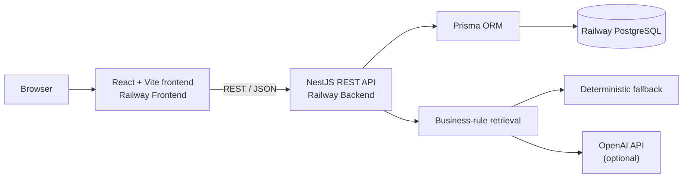

# AI BookingMate

A production-deployed full-stack booking and customer-support platform for service businesses, featuring capacity-based scheduling, role-based administration, and a business-rule-grounded assistant.

[](https://react.dev/)
[](https://www.typescriptlang.org/)
[](https://nestjs.com/)
[](https://www.postgresql.org/)
[](https://www.prisma.io/)
[](https://www.docker.com/)
[](https://railway.com/)
[](https://jestjs.io/)

## Live Demo

- [Live Application](https://frontend-production-f42b.up.railway.app)
- [Backend Health](https://backend-production-3ddab.up.railway.app/health)
- [Swagger API Documentation](https://backend-production-3ddab.up.railway.app/api/docs)

Public registration is available. Administrator access is not publicly shared.

## Demo Overview

AI BookingMate models a real service-booking workflow from public discovery through administration. Customers can register, browse services, inspect capacity, book private or group sessions, and manage their bookings. Administrators can configure services, schedules, capacities, bookings, and the business rules that ground assistant answers.

## Key Features

### Customer experience

- Registration and JWT-based login
- Public service and available-time browsing
- Private and capacity-based group bookings
- Personal booking history and cancellation
- Live remaining-place visibility

### Administration

- Create, update, and deactivate services
- Create, block, unblock, filter, and edit time slots
- Configure capacity for private and group sessions
- Review, confirm, and cancel customer bookings
- Manage assistant business rules

### Grounded assistant

- Retrieves administrator-defined business rules before answering
- Supports optional OpenAI synthesis without exposing the API key
- Uses a deterministic retrieval fallback when OpenAI is unavailable
- Shows answer mode, confidence, and grounding sources

### Engineering

- Transaction-safe capacity enforcement and cancellation restoration
- Concurrent-overbooking protection
- Role-based backend authorization
- Secure password-reset token hashing, expiry, and single-use handling
- Versioned Prisma migrations and production environment validation
- Database-aware health monitoring and Swagger documentation

## Architecture



The frontend reads its public API URL at container startup. The backend owns authentication, authorization, booking transactions, assistant grounding, and database access.

## Technical Highlights

### Capacity-based group bookings

Each time slot has configurable capacity. `PENDING` and `CONFIRMED` bookings consume places, while `CANCELLED` bookings release them. Full slots disappear from public availability and cannot accept new bookings.

### Concurrency protection

Booking writes use serializable transactions with PostgreSQL advisory locking around each time slot. Concurrent requests reload current booking state inside the lock, preventing successful bookings from exceeding capacity.

### Authentication and authorization

JWT authentication protects customer workflows. `CUSTOMER` and `ADMIN` roles are enforced by NestJS guards, with the backend remaining the authorization boundary for every administrative action.

### Assistant grounding

The assistant retrieves active FAQ content and administrator-defined rules before responding. OpenAI synthesis is optional; the tested deterministic fallback remains available when no API key is configured or the external request fails.

### Password-reset security

Reset tokens are cryptographically random, stored only as SHA-256 hashes, expire after 30 minutes, and are single-use. Production never exposes raw reset tokens. Email delivery is intentionally disabled in the public demo.

## Tech Stack

| Area | Technologies |
| --- | --- |
| Frontend | React, TypeScript, Vite, React Router, Axios, CSS |
| Backend | NestJS, TypeScript, Prisma, PostgreSQL, JWT, Passport, bcrypt, Swagger |
| Testing | Jest, Supertest, isolated PostgreSQL E2E database |
| Deployment | Docker, Nginx, Railway, GitHub |

## Screenshots

The screenshot set is intentionally marked as pending so missing image files are not presented as completed assets. See the [screenshot capture guide](docs/screenshots/README.md) for the required routes, filenames, and privacy checks.

<table>
  <tr>
    <td width="50%"><strong>Home</strong><br><code>docs/screenshots/home.png</code><br><em>Screenshot pending</em></td>
    <td width="50%"><strong>Services</strong><br><code>docs/screenshots/services.png</code><br><em>Screenshot pending</em></td>
  </tr>
  <tr>
    <td><strong>Booking capacity</strong><br><code>docs/screenshots/booking-capacity.png</code><br><em>Screenshot pending</em></td>
    <td><strong>My Bookings</strong><br><code>docs/screenshots/my-bookings.png</code><br><em>Screenshot pending</em></td>
  </tr>
  <tr>
    <td><strong>Admin time slots</strong><br><code>docs/screenshots/admin-time-slots.png</code><br><em>Screenshot pending</em></td>
    <td><strong>Admin business rules</strong><br><code>docs/screenshots/admin-rules.png</code><br><em>Screenshot pending</em></td>
  </tr>
  <tr>
    <td><strong>Assistant</strong><br><code>docs/screenshots/assistant.png</code><br><em>Screenshot pending</em></td>
    <td><strong>Swagger</strong><br><code>docs/screenshots/swagger.png</code><br><em>Screenshot pending</em></td>
  </tr>
</table>

## API Documentation

Interactive production documentation is available through [Swagger UI](https://backend-production-3ddab.up.railway.app/api/docs). The API covers authentication, services, time slots, capacity-aware bookings, business rules, assistant questions, and health monitoring.

## Testing

Verified automated results:

- Backend unit tests: **4 suites, 12 tests passed**
- Backend E2E tests: **6 suites, 29 tests passed**

The isolated E2E suite covers authentication, services, time slots, bookings, capacity and concurrent booking, business rules, assistant fallback, password reset, and health checks. It requires a dedicated `DATABASE_URL_TEST` whose database name contains `test`, and automated tests do not make real OpenAI requests.

```cmd
cd backend
npm run test -- --runInBand
npm run test:e2e
```

## Security and Reliability

- Passwords are hashed with bcrypt
- Reset tokens are hashed before storage and safely expired
- Forgot-password responses prevent account enumeration
- JWT and role guards protect private operations
- DTO validation rejects unexpected request properties
- OpenAI, JWT, and database secrets remain server-side
- Production startup validates required environment values
- PostgreSQL-backed health checks expose deployment readiness
- Prisma migrations run through `prisma migrate deploy`

## Local Development

Prerequisites: Node.js 22+, npm, and PostgreSQL 16 or Docker Desktop.

```cmd
git clone https://github.com/lyccccccccccccc/ai-bookingmate.git
cd ai-bookingmate
docker compose up -d postgres

cd backend
copy .env.example .env
npm install
npx prisma migrate dev
npm run seed
npm run start:dev
```

In a second terminal:

```cmd
cd frontend
copy .env.example .env
npm install
npm run dev -- --port 5174
```

The provided development examples use `http://localhost:3001` for the backend, `http://localhost:5174` for the frontend, and `localhost:5433` for PostgreSQL. Local `.env` files are ignored by Git.

## Production Deployment

The public demo runs as separate Railway PostgreSQL, backend, and frontend services. The backend and frontend use service-local Dockerfiles, Prisma migrations run as a backend pre-deploy command, and Nginx provides SPA fallback routing.

See the [Railway deployment guide](docs/railway-deployment.md) and [production release checklist](docs/production-release-checklist.md) for environment variables, migration safety, health checks, initial admin setup, backups, and rollback.

## Known Limitations

- Password-reset email delivery is not enabled in the public demo
- OpenAI-generated responses require a server-side API key
- Without OpenAI, the assistant uses its tested retrieval fallback
- Payment processing and notifications are outside the current project scope

## Future Improvements

- Transactional email delivery for password resets and booking notifications
- Payment-provider integration
- Calendar synchronization and reminder scheduling
- Expanded observability, audit history, and automated CI checks

## Author

Built as a full-stack software engineering portfolio project by [lyccccccccccccc](https://github.com/lyccccccccccccc).
